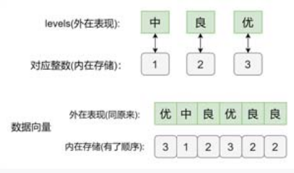

- 数据(变量)可划分为:定量数据(数值型)、定性数据(分类型)，定性数据又分为名义型(无好坏顺序之分，如性别)、有序型(有好坏顺序之分，如疗效)
- R提供了因子，专门存放名义型和有序型的分类变量。因子本质上是一个带有水平(level)属性的整数向量，其中"水平"是指事前确定可能取值的有限集合。例如,性别有两个水平:男、女。
- 直接用**字符向量**也可以表示分类变量，但它只有**字母顺序**，不能规定**想要的顺序**，也不能表达有序分类变量。所有，有必要把字符型的分类变量转化为因子型，这更便于对其做后续描述汇总，可视化，建模等。

- 不能直接将因子数据当字符型操作,需要用as.character()转化。
- 转化为因子型后，数据向量显示出来与原来一样，但内在存储已经变了。因子型是以整数向量存储的，将各水平值按照规定的顺序分别对应到整数，将原向量的各值分别用相应的整数存储，输出和使用的时候再换回对应的水平值。整数是有顺序的，这样就相当于再不改变原数据下的前提下规定了顺序,同时也节省了存储空间。

forcasts 包
tidyverse系列中的forcasts包是专门为处理因子型数据而设计的,提供了一系列操作因子的方便函数。
- as_factor():转化为因子，默认按水平值的出现顺序。
- fct_count():计算因子各水平频数、占比、可按频数排序。
- fct_c():合并多个因子的水平
- fct_inorder():按水平值出现的顺序
- fct_levels():手动对水平值重新排序
- fct_rev():将顺序反转
- fct_reorder():根据其他变量或函数结果排序(绘图时有用)
修改水平:
- fct_recode():对水平值逐个重编码
- fct_collapse():推倒手动合并部分水平
- fct_lump_*():将多个频数小的水平合并为其他
- fct_other()：将保留之外或丢弃的水平合并为其他

