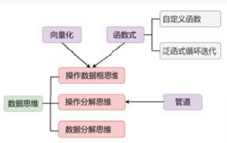

`Tidyverse包`::Tidyverse用"现代的"、"优雅的"方式，以管道式、泛函式编程技术实现了数据科学的整个流程:00数据导入-数据清洗-数据操作- 数据可视化-数据建模-可重现与交互报告。

学任何一门编程语言，根据我的经验，有这么几点建议(步骤)：
1. 理解该编程语言的核心思想,比如R语言是面向函数也面向对象，另外，高级语言还都倡导向量化编程。在核心思想的引领下去学它去思考去写代码。
2. 学习该编程语言的基础知识(包括数据类型以及数据结构(容器)、分支/循环结构、自定义函数、文件读写、可视化等)，这些基础知识本质上是想通的同样的东西，只是在不同编程语言下披上了其特有的外衣(编程语法)。

正确的编程：先学习并掌握编程元素和语法规则，比如数据结构、分支/循环结构、自定义函数等，然后**遇到具体问题，分解问题**，借助实例梳理，根据掌握的编程元素和语法规则翻译成代码并调试通过，从而自己写出代码解决问题。

为什么大家普遍自己写代码解决具体问题时感觉无从下手？
这是因为你总想一步就从问题到代码，没有中间的过程，即使编程高手也不能做到！
正确的做法是： **分解问题+实例梳理+翻译即调试**
具体如下：
- 将难以入手大问题分解为可以逐步解决的小问题
- 用计算机思维去思考解决每步小问题
- 借助类比的简单实例和代码片段，梳理出详细算法步骤
- 将详细算法步骤逐步用逐片段地用编程语法翻译成代码并调试的通过

R语言的编程思想
**面向对象**
R是一种基于对象的编程语言,即在定义类的基础上,创建与操作对象;数值向量、函数、图形等都是对象。Python的一切皆为对象也适用于R。

早期和底层R语言中的面向对象编程是通过泛型函数来实现的,以S3类、S4类为代表.新出现的R6类更适合用来实现通常所说的面向对象编程(OOP),包含类，属性，方法，继承，多态等。


笼统来说,R语言就两个事情:数据，对数据应用操作。这个操作就是函数,包括R自带的函数,各种扩展包里的函数，自定义的函数。

?函数名
- 函数的描述
- 函数的语法格式
- 函数参数说明
- 函数的返回值
- 函数示例


编程中一种重要的思维就是**函数式思维**,包括**自定义函数(把解决某问题的过程封装成函数)**和**泛函式编程(把函数依次应用到一系列的对象上)**

如果找不到现成的函数解决自己的问题，那就需要自己自定义函数,R自定义中函数的基本语法为:
函数名 = function(参数列表){
    函数体
    return(返回值) #若有多个输出，需要打包成一个list
}
```r
AreaCircle = function(r){
    return(pi*r**2)
}

rs = c(2,4,7)
map_dbl(rs,AreaCircle) # purrr包
```
定义函数就好比创造摸具,调用函数就好比用摸具批量生产产品。使用函数最大的好处，就是将实现某个功能,封装成摸具，从而可以反复使用。这就避免了写大量重复的代码，程序的可读性也大大加强。

高级编程语言都提倡向量化编程,说白了就是，对一列/矩阵/多维数组的数同时做同样的操作，即提升程序的效率,又大大简化代码。



清屏
- Ctrl + L

清除内存变量
- rm(x)
- rm(list=ls(all = TRUE))


若想根据某算法的名字或关键词,搜索哪个包能实现该算法:
RSiteSearch("network")

