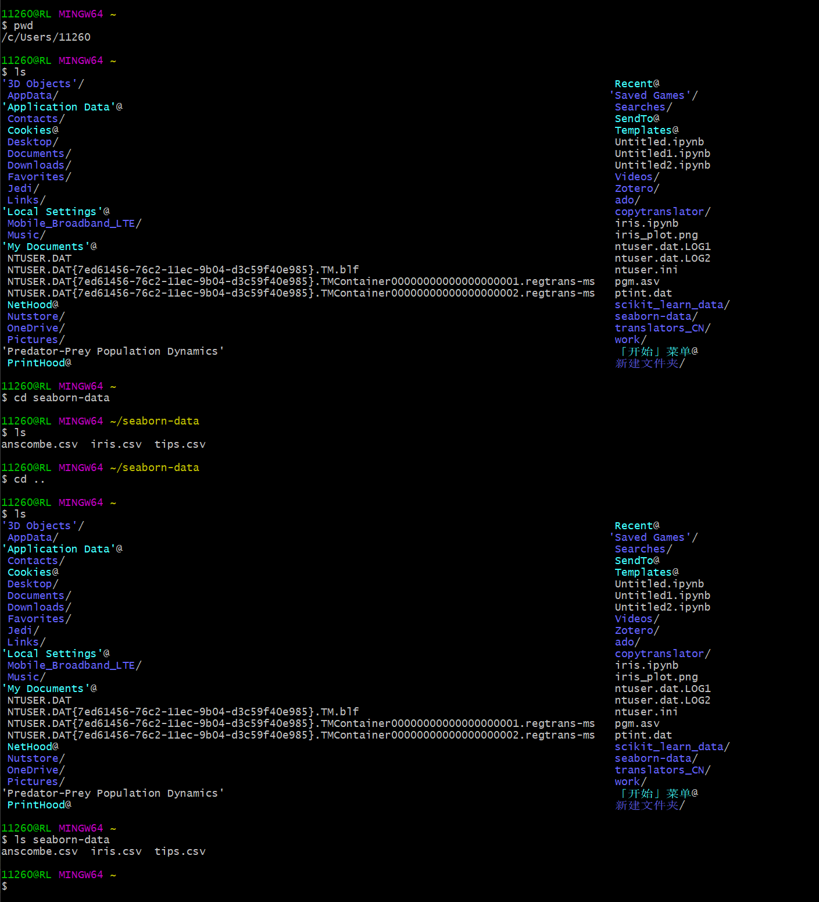

打开命令shell(Mac中是Terminal,Windows中是Git Bash)

正在查看的目录(Mac目录是~/Documents, Windows中的目录是~/Desktop)~是主目录的缩写

$ 命令提示符
\# 注释符

计算机上的文件夹按层次结构存储,这形式形成了一种树状结构。

通过在树中的每个文件夹之间加上斜线(/)来表示当前的文件夹。`/Users/mikefree`的意思是mikefree文件夹在Users文件夹中。 这与`/Users/mikefree/`意思一样。
最顶层是根目录，他没有名字，只有一个斜杠。`/Users/mikefree`表示：根目录下有个Users文件夹，Users文件夹下有个mikefree文件夹。

对于那些不是在当前目录下的文件夹，cd和ls同样适用。通过指定路径参数可引用计算机上的任何文件或文件夹
路径有根目录称为绝对路径`cd /h/linux `表示从根目录开始(第一个是/)而后进入linux
从根目录开始的，所以无论你现处于什么文件夹下，该用户都能转到正确目录中。
`cd linux/shell编程基础` 该路径没有最前面的斜杠，它表示“从当前位置转到linux/shell编程基础”这是一个相对路径的例子:将转到相对当前文件夹的文件夹中。

在编程问题上应该使用相对路径!因为一个项目总是包含着多个文件，应该标明这些文件相对于项目本身的路径，这样，<font color = cyan>程序就可轻松地放到其他计算机上运行</font>
使用点号(.)来指向当前文件夹
使用两个点(..)会指向父文件夹(是指包含当前文件夹的文件夹)


~ 来表示当前用户的主目录的绝对路径，一般是/Users/USER_NAME

```shell
#print the working directory

pwd

# change the working directory to the child folder with the name "julia"

cd h:/julia

#List the contents of the current folder

ls

#List the contents of the current directory

ls .
# List the contents of the parent directory

ls ..

# Remove all files with the extension '.txt'(careful!)
rm *.txt


```
|命令|功能|
| :--|:--|
|mkdir|创建一个文件或文件夹|
|rm|删除一个文件或文件夹|
|cp|将文件从一个位置复制到另一个位置|
|open|打开文件或文件夹(Mac)|
|start|打开文件或文件夹(Windows)|
|cat|连接(合并)文件内容并显示结构|
|history|显示以前执行的命令|
|!!|重复之前的命令|
<font color = cyan>学习的一种方式是查阅官方编写的资料(通常称为文档)，其解释了语法内容。这类信息科在线查询，但很多命令shell(不幸的是，不包括Git Bash)都自带了可用来查询的手册。</font>
```shell
# View the manual for the 'mkdir' command(not available in Git Bash)
man mkdir
```

[[bash]]
通配符:
\*.txt 代表所有具有.txt扩展名的文件
cat \*.csv 将输出文件夹中所有.csv

hello\*.txt代表所有文件名以hello开头的文件


重定向输入
\>是指获取命令的输出结果并将其保存到文件中，例如`echo “Hello World” \> hello.txt`
注意这将替换文件已有内容,如果文件不存在将新建文件
\>>是获取命令的输出并附加到文件末尾,这能有效防止覆盖文件已有内容
| (管道符)是指获取命令的输出并将其发送到下一个命令

网络命令
命令行的常见用途之一是访问并控制远程计算机——是指可连接到网络上的计算机
最常用的访问远程计算机的工具是ssh(secure shell)命令
[[ssh]]是一个确保在网络上安全传输信息的命令工具和协议

most remote machines don’t let just anyone connect to them for security reasons. Instead, you need to specify your username for that machine.
`ssh mikefree@ovid.washington.edu`
一旦连接到远程服务器，会显示远程服务器的命令提示符


At that point, you can use commands like pwd and ls to see where you are on that remote computer, cd to navigate to another folder, and any other command line command you wish—just as if you had opened a terminal on that machine!

Once you are finished working on the remote machine, you can disconnect by using the exit command. Closing the command shell will also usually end your connection, but using exit will more explicitly stop any ongoing processes on a remote machine.
The ssh utility will let you connect to a remote machine and control it as if it were right in front of you. 

BUT if you want to  move files between your local machine and the remote one, you will need to use the scp(secure copy) command.

To copy a local file to a location on a remote machine, you need to specify the username and host URL of that machine, similar to what you would use to connect via ssh.

```shell
#Securely copy the local file data.csv into the projects folder on the remote machine
scp data.csv
mikefree@ovid.washington.edu:~/projects

# Or more generically
scp MY_LOCAL_FILE
username@hostname:path/to/destination
```