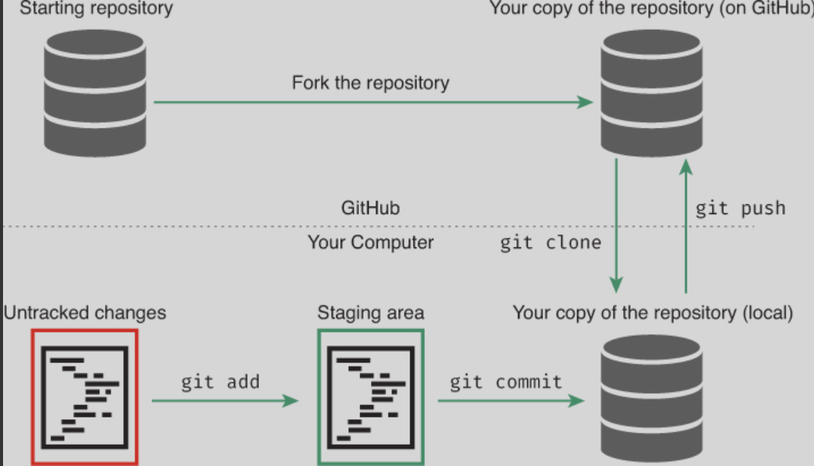
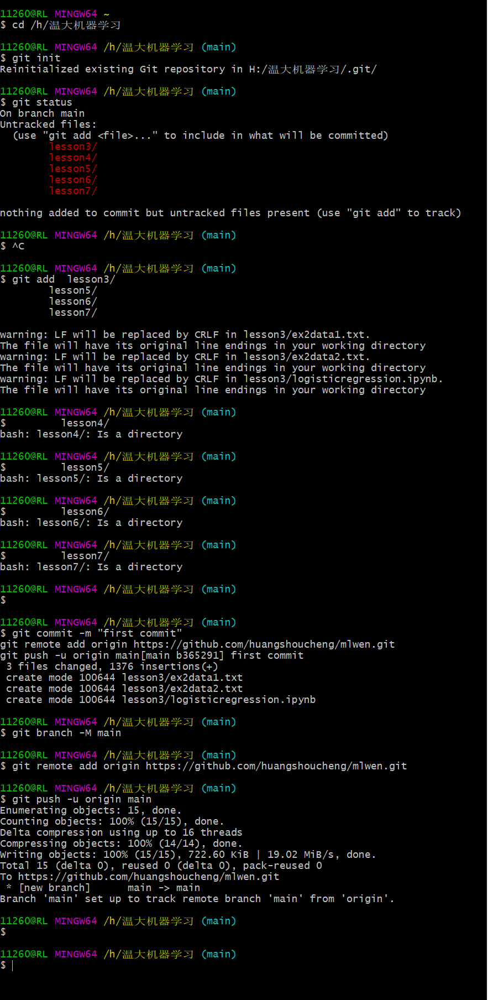
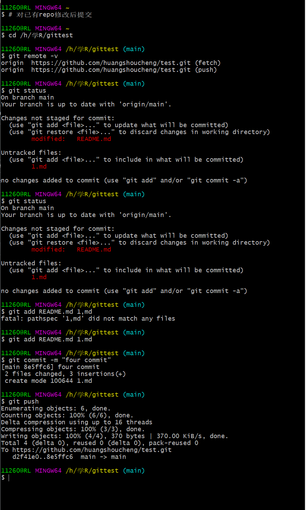

One of the most import parts of writing code to work with data is keeping track of changes to your code. 
Maintaining a clear and well-documented history of your work is crucial for transparency and collaboration. 
Even if you are working independently, tracking your changes will enable you to revert to earlier versions of your project and more easily identify errors.

##### 什么是Git
A version control system (VCS) is a tool for managing a collection of program code that provides you with three important capabilities: reversibility, concurrency, and annotation.

where git really comes in handy is in team development

[[git]]的核心
- 仓库(repo) ：保存在项目目录下名为.git的隐藏子目录中。If you want to sound cool and in-the-know, call the project folder itself a “repo”

- 提交 ：被添加到仓库(以数据库保存)的某个时间点的工作快照，或检查点
- 远程 ：指向非本机上仓库副本的链接。该链接指向了Web上副本存储的位置 You can push (upload) commits to, and pull (download) commits from, a remote repository to keep everything in sync.
- 合并：git支持多个不同版本的工作,所有版本并行存在着(在所谓的分支中)，这些版本可以由一个人或多个合作者创建。 git supports having multiple different versions of your work that all live side by side (in what are called branches), which may be created by one person or by many collaborators. 

git was created to support completely decentralized development, in which developers pull commits (sets of changes) from one another’s machines directly.

GitHub是一个云托管项目副本的网站,支持多人协作(使用git)。GitHub is a site that will host a copy of your project in the cloud, enabling multiple people to collaborate (using git).
git用来做版本控制；GitHub是一个可以用来保存代码仓库的地方。
##### 配置和项目设置
安装后第一次使用git，需要配置用户信息,以便你能够向仓库提交更改。
```shell
# Configure 'git' on your machine(only needs to be done once)

# Set your name to appear alongside your commits
#This *does not* need to be your GitHub username
git config --global user.name "YOUR FULLNAME"

# Set your email address
# This *does not* need to be the email associated with your GitHub accout

git config --globel user.email "YOUR_EMAIL_ADDRESS"

```
配置完成用户信息后,每天往GitHub提交代码仍旧需要输入密码，为GitHub设置一个[[ssh]]密匙可节省一些时间。
 <font color=#00FFFF>Generating a new SSH key</font>[](https://docs.github.com/en/authentication/connecting-to-github-with-ssh/generating-a-new-ssh-key-and-adding-it-to-the-ssh-agent)
###### 生成一个仓库
```shell
# Create a new folder in your current location called `learning_git`
mkdir learning_git

# Change your current directory to the new folder you just created
cd learning_git

# Initialize a new repository inside your 'learning_git' folder
git init
```
git init 命令在当前目录新建了一个.git的隐藏文件夹。因为是隐藏的，查找器查不到该文件夹，但是用ls -a(带all参数的"list"命令)可看到。该文件夹是所作改动的“数据库”,git将保存这个文件夹中所有提交的改动。包含.git的文件夹会将一个目录转换成一个仓库,你可将整个目录称为“repo”
###### 检查状态
创建完repo后,下面将会介绍如何检查他的状态
```shell
# Check the status of your repository
#(this and other commands will only work inside git project folders)
git status
```
git status 命令将显示repo的状态。在一个新的repo上，执行该命令会列出下面的信息：
```shell
On branch master

No commits yet

nothing to commit(create/copy files and use "git add" to track)
```
在整个使用git过程中,git status是最有用的命令。在学习git基础知识时,在执行命令前后，查看一次项目更改状态是相当有用的。学习它，使用它，热爱它。

##### 跟踪项目变更
###### 添加文件
第一步是将这些改动添加到临时区域。临时区域就像在线商店的购物车：在更改记录提交到数据库之前(例如,在点击"购买"前),将改动放在临时存储区中。
```shell
# Add changes to a file with the name FILENAME to the staging area
# Replace FILENAME with the name of your file (e.g. books.txt)
git add FILENAME
```
这会将处于当前保存状态的单个文件添加到临时区域。如果以后改动该文件,需要再次运行git add命令添加文件的更新版本。
```shell
# Add all saved contents of the directory to the staging area
git add .


```
###### 提交
如果对临时区域的内容感到满意(即准备购买)，就到提交这些更改的时间了,将文件的快照保存到仓库数据库中。
```shell
# Create a commit(checkpoint) of the changes in the staging area
# Replace "Your message here" with a more informative message
git commit -m "sencond commit"

```
提交更改完成后,确保核对git status的执行结果

#### 审核本地git流程
使用git的标准"开发循环"是编辑文件、添加文件、提交更改的循环
通常，代码要做大量改动(编辑大量文件、运行和测试代码等)，不过一旦有了好的“断点”,一旦要添加和提交更改,以确保工作不丢并能够随时回到这个“断点”位置。“断点”可以实现了一个功能、卡壳了需要喝咖啡了或是计划进行彻底更改。
<font color=#00FFFF>注意:</font>每次提交意味着一组改动,通常波及多个文件.不要一个文件的一次改动就提交一次;相反，每次提交应该是整个项目的快照
<font color=#00FFFF>技巧:</font>如果无意中添加了不想添加的文件,可通过git reset命令(没有参数)从临时区域中删除所有添加过的文件。
如果无意中提交了不想提交的文件,可使用git reset --soft HEAD~1撤销提交

#### 在GitHub中存储项目
git 是用来创建和管理仓库的，Github只是存储仓库的网站。


学会了在本地使用git跟踪项目后,就会向使用不同的计算机来访问项目或者与他人共享项目。这个时候,就该使用GitHub了,GitHub提供云存储仓库副本的在线服务。
Repositories stored on GitHub are examples of remotes: other repos that are linked to your local one. Each repo can have multiple remotes, and you can synchronize commits between them. Each remote has a URL associated with it (indicating where on the internet the remote copy of the repo can be found), but they are given “alias” names—similar to browser bookmarks. By convention, the remote repo stored on GitHub’s servers is named origin, since it tends to be the “origin” of any code you’ve started working on.

本地仓库链接到GitHub的远程副本。执行此操作有两个常见的过程:
1.如果在本地计算机上已经存在git跟踪过的项目,通过单击GitHub主页(需要登录)上的绿色"New Repository"按钮新建一个repo,这会在当前GitHub账户下新创建一个空的repo。按照GitHub提供的指令，链接本地的repo到GitHub上新建的repo。

2.如果GitHub存在一个要在本地编辑的项目,可先克隆(下载)GitHub上的repo副本,而后进行修改和编辑代码。因该过程较为常见，所以这里进行了详细的描述.

###### 分支和克隆
“Fork”按钮对一个repo进行分支。这将repo复制到自己GitHub上，而后就能下载和上传更改到副本中,但不是上传到最原始的repo中。使用git clone 命令下载repo到自己的目录中:


```shell
# Change to the folder that will contain the downloaded repository folder
cd ~/Desktop

#Download the repository folder into the current directory
git clone REPO_URL
```
该命令在当前文件夹下创建了一个新的repo(目录),并将URL指定的代码副本和所有提交下载到新的文件夹中。

###### 推送和拉取
一旦有份repo代码的副本,就可在本地计算机上更改代码，随后将更改推送大GitHub上可以。
After making changes, you will, of course, need to add the changed files to the staging area and commit the changes to the repo (don’t forget the -m message!).

使用编辑器修改这些文件，修改完后，就需要将改动的文件添加到临时区域中,并提交到repo中(不要忘记使用-m参数添加备注)
提交将保存更改到本地,但没将这些更改推送到GitHub上。
```shell
# Push commits from your computer up to a remove server(e.g.,GitHub)
git push
```
该命令会将当前代码推送到原始远程副本中（推送到副本中的主分支）下面命令可查看远程位置：
```shell
#print out (verbosely) the remote location(s)
git remote -v
```
推送完刷新页面即可看到更改

如果要下载他人做的更改,可使用pull命令。该命令将从GitHub下载更改并将其融合到本地计算机代码中
```shell
#Pull changes down from a remove server(e.g.,GitHub)
git pull

```

因为拉取代码过程包含将不同代码版本融合到一起,一定要当心融合冲突

##### 访问项目历史
```shell
# Print out a repository's commit history
git log

```
按顺序列出提交的所有历史:有提交者、提交内容和提交时间(标识HEAD是指最近的提交)

###### 恢复早期版本
版本控制系统的一个主要优点是可逆性,即具有“撤销”一个错误的能力
使用checkout命令,可回滚到文件的旧版本-
```shell
#Print a list of commit hashes
git log --oneline

#Check(load) the version of the file from the given commit
git checkout COMMIT_HASH FILENAME
```
将COMMIT_HASH和FILENAME分别替换成提交ID的哈希值和要回滚的文件。

git status:：检查repo状态
git add:：添加文件到临时区域
git commit -m "Message"：提交更改
git clone:：复制一个repo 到本地计算机上
git push：上传提交到GitHub中
git pull：从GitHub上下载提交
初次推送到Github

再次推送到Github


# See a list of current branches in the repo
git branch
# Switch to the BRANCH_NAME branch
git switch BRANCH_NAME

# Create and switch to a new branch called `experiment`
git switch -c experiment


```shell
# Make sure you are on the `main` branch
git switch main

# Merge the `experiment` branch into the current (`main`) branch
git merge experiment
```

### Developing Projects Using Feature Branches
```shell
#You decide to add a new feature to the project: a snazzy visualization. You create a new feature branch off of `master` to isolate this work:
# Make sure you are on the `main` branch
git checkout main

# Create and switch to a new feature branch (called `new-chart`)
git switch -c new-chart


# You then do your coding work while on this branch. Once you have completed some work, you would make a commit to add that progress:
# Add and commit changes to the current (`new-chart`) branch
git add .
git commit -m "Add progress on new vis feature"

# Unfortunately, you may then realize that there is a bug in the `master` branch. To address this issue, you would switch back to the `master` branch, then create a _new branch_ to fix the bug:
# Switch from your `new-chart` branch back to `main`
git switch main

# Create and switch to a new branch `bug-fix` to fix the bug
git switch -c bug-fix


# After fixing the bug on the `bug-fix` _branch_, you would `add` and `commit` those changes, then checkout the `main` branch to merge the fix back into `master`:

# Add and commit changes that fix the bug (on the `bug-fix` branch)
git add .
git commit -m "Fix the bug"

# Switch to the `master` branch
git switch main

# Merge the changes from `bug-fix` into the current (`master`) branch
git merge bug-fix

# Now that you have fixed the bug (and merged the changes into `master`), you can get back to developing the visualization (on the `new-chart` branch). When it is complete, you will `add` and `commit` those changes, then checkout the `master` branch to merge the visualization code back into `master`:
# Switch back to the `new-chart` branch from the `master` branch
git switch new-chart

# Work on the new chart...

# After doing some work, add and commit the changes
git add .
git commit -m "Finish new visualization"

# Switch back to the `master` branch
git switch main

# Merge in changes from the `new-chart` branch
git merge new-chart

# 删除分支
git branch -d new-chart 
```

http://www.catb.org/esr/writings/ eric raymond blog


