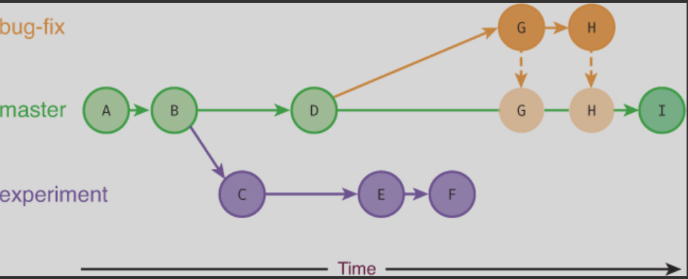
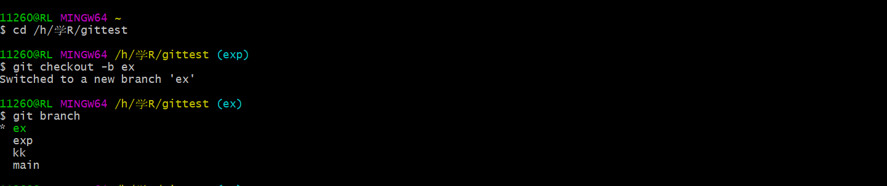
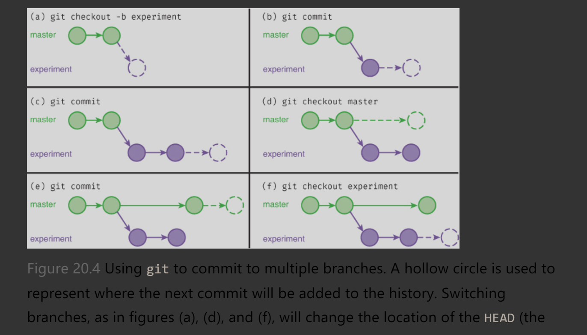
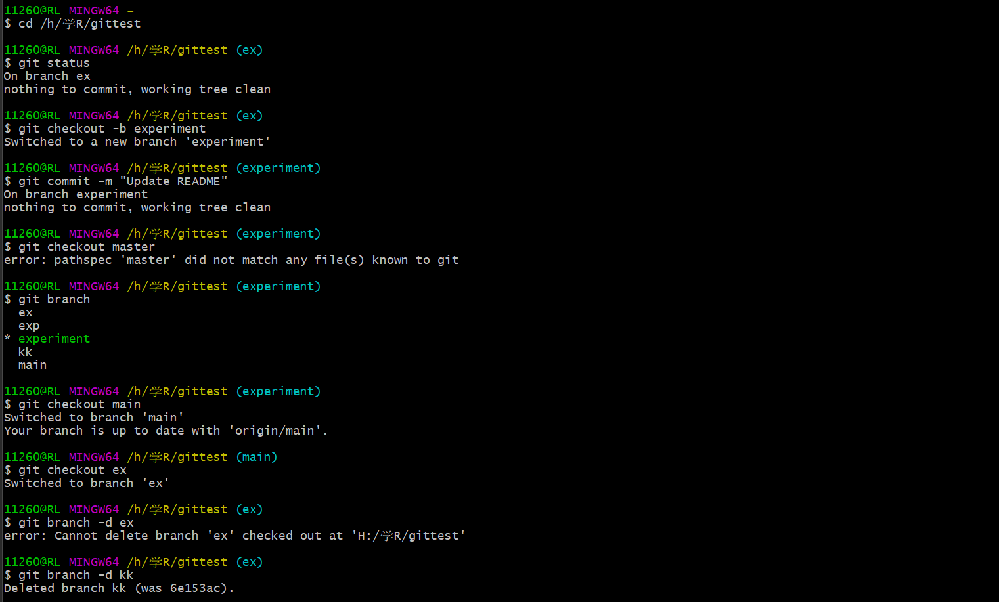
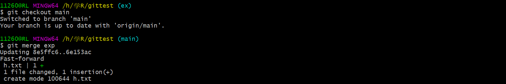
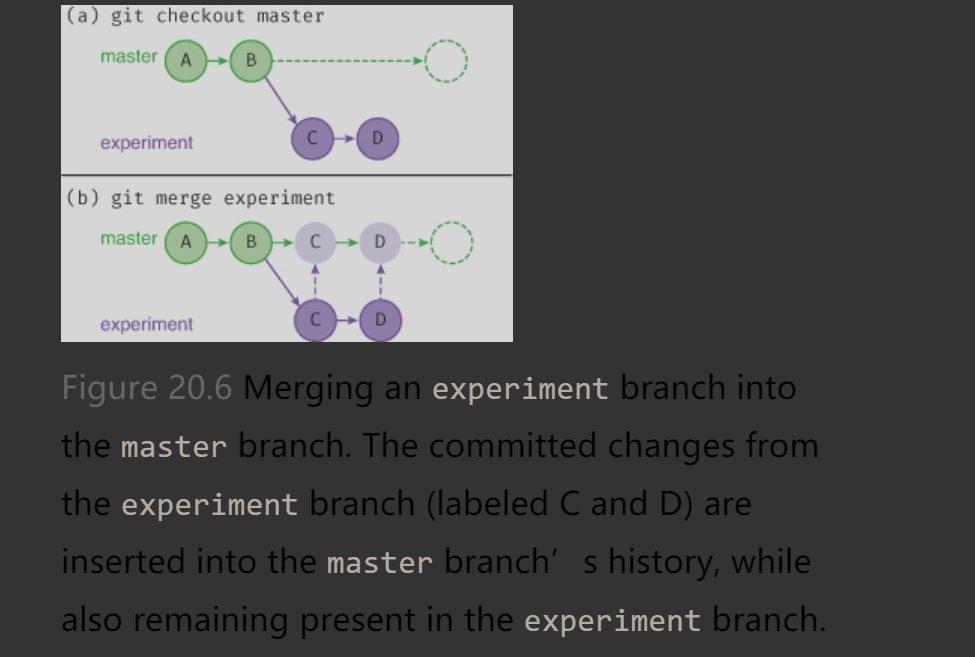
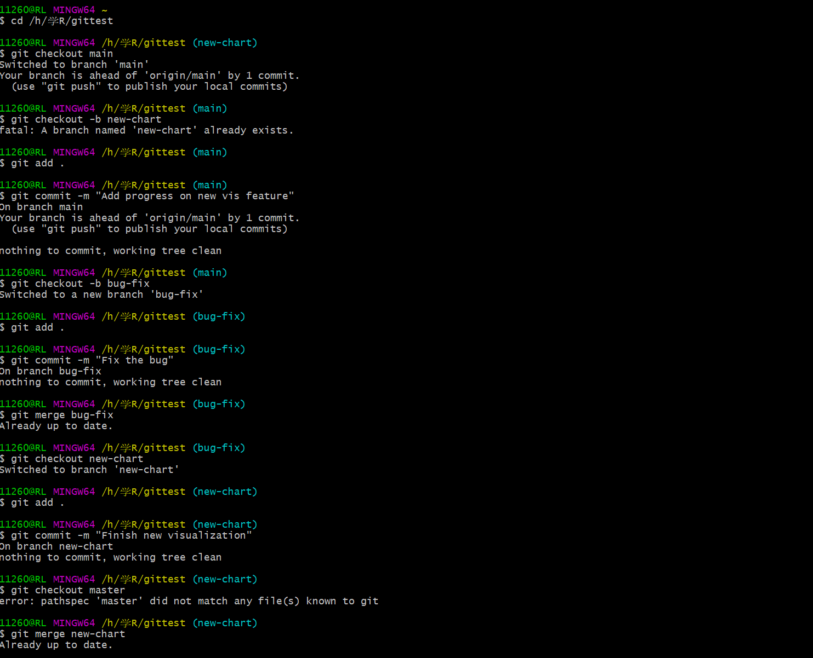

# Working Collaboratively

- To be a successful member of a data science team, you will need to be able to effectively collaborate with others
- Many of the techniques for supporting collaborative coding involve writing clear, well-documented code (as demonstrated throughout this book!) that can be read, understood, and modified by others. 
- you will also need to be able to effectively integrate your code with code written by others, avoiding any “copy-and-pasting” work for collaboration. 
- one of the biggest benefits of git is its ability to support collaboration (working with other people). 
- In this chapter, you will expand your version control skills to maintain different versions of the same code base using git’s branching model

- A branch in git is a way of labeling a sequence of commits. 

- This linear sequence represents a workflow using a single line of development. 


Figure 20.1 A diagram of a linear sequence of commits alongside a log of the commit history as shown in the terminal. This project has a single history of commits (i.e., branch), each represented by a six-character commit hash. The HEAD―most recent commit―is on the master branch.

- In addition to supporting single development lines, git supports a nonlinear model in which you “branch off” from a particular line of development to create new concurrent change histories.ou can think of these as “alternate timelines,” which are used for developing different features or fixing bugs.


- A sequence of commits spread across multiple branches, producing “alternate time-lines.” Commits switch between being added to each branch (timeline). The commits on the bug-fix branch (labeled G and H) are merged into the master branch, becoming part of that history.

### Working with Different Branches
- All git repositories have at least one branch (line of development) where commits are made.**By default, this branch is called master**.

- You can view a list of current branches in the repo with the git **branch** command:

- The line printed with the asterisk (*) is the **“current branch”** you’re on.
- You can use the same git branch command to **create a new branch**:
- Creating a new branch is **similar** to creating a new pointer to a node in the linked list data structure from computer science.
- To switch to a different branch, you use the **git checkout** command
- Checking out a branch doesn’t actually create a new commit! All it does is **change the HEAD** so that it now refers to the latest commit of the target branch (the alternate timeline).
- HEAD is just an **alias** for “the most recent commit on the current branch.”
- 
- 可通过git checkout命令的 -b 选项直接新建并切换分支。推荐使用这种方法。
- 
- Once you have checked out a particular branch, any new commits from that point on will occur in the “alternate timeline,” without disturbing any other line of development. New commits will be “attached” to the HEAD (the most recent commit on the current branch), while all other branches (e.g., master) will stay the same. If you use git checkout again, you can switch back to the other branch. This process is illustrated in Figure 20.4.
- 
- 
使用`git branch -d BRANCH_NAME` 删除分支
### Merging Branches
- If you have changes (commits) spread across multiple branches, eventually you will want to combine those changes back into a single branch.
- This process is called merging: you “merge” the changes from one branch into another.
-  You do this with the (surprise!) **git merge** command

合并是将其他分支的提交插入到当前分支的历史记录中。
- 

- Note that the git merge command will merge OTHER_BRANCH into the branch you are currently on. 
### 按照特性分支开发项目

##### 将开发工作划分成不同的特性分支是良好的组织方式，每个分支专门用于项目的不同特性(能力或部分)
一个分支叫new-chart,专注于复杂的可视化;另外一个分支叫experimental-analysis,用于尝试分析数据的新方法。
每个分支都是基于项目的一个特性，而不是某个人:一个开发人员可在多个特性分支上工作。多个开发人员可以在一个特性分支上合作。


### 使用集中工作流协作

```shell
# Pull latest changes from 'origin' (GitHub's)'master' branch
```

#### 当下载更改时，git实际上将远程分支与本地分支进行了合并

### 在集中工作流中使用特性分支
### Using Feature Branches in the Centralized Workflow
#### the feature branch workflow

As an example of this workflow, consider the collaboration on a feature occurring between two developers, Ada and Bebe:

经常要本地分支与GitHub的远程仓库间建立关联。可使用push命令的-u选项进行关联：
` git push origin BRANCH_NAME`
`git fetch`命令将从GitHub"下载"提交和分支(但不合并);它用于访问克隆仓库后新建的分支。"git pull"实际上是`git fetch紧跟git merge`的快捷方式
删掉特性分支`git branch -d BRANCH_NAME`
删掉该分支的GitHub版本,或者使用`git push origin -d BRANCH_NAME`

### Collaboration Using the Forking Workflow
### 使用分叉工作流协作
Rather than having a single shared remote repository, each developer has their own repository on GitHub that is forked from the original repository

