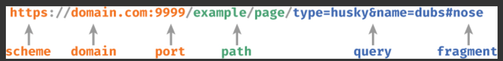
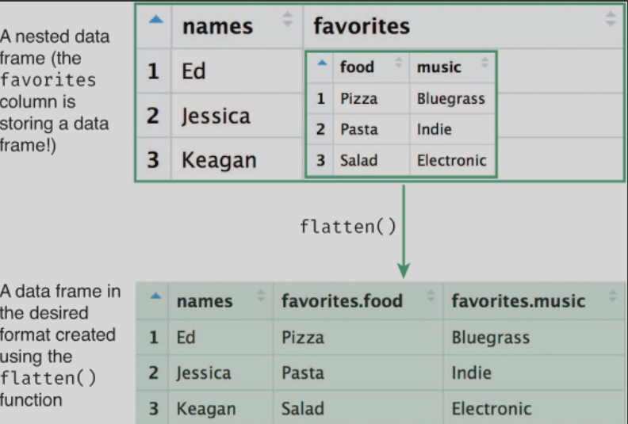

如何使用R以编程的方式与Web服务存储的数据进行交互
An interface is the point at which two different systems meet and communicate, exchanging information and instructions. An application programming interface (API) thus represents a way of communicating with a computer application by writing a computer program (a set of formal instructions understandable by a machine). APIs commonly take the form of functions that can be called to give instructions to programs. For example, the set of functions provided by a package like dplyr make up the API for that package.

- scheme (protocol): The “language” that the computer will use to communicate the request to the API. With web services this is normally https (secure HTTP).

- domain: The address of the web server to request information from.

- path: The identifier of the resource on that web server you wish to access. This may be the name of a file with an extension if you’re trying to access a particular file, but with web services it often just looks like a folder path!

- query: Extra parameters (arguments) with further details about the resource to access.


HTTP Verbs
- GET: Return a representation of the current state of the resource.

- POST: Add a new subresource (e.g., insert a record).

- PUT: Update the resource to have a new state.

- PATCH: Update a portion of the resource’s state.

- DELETE: Remove the resource.

- OPTIONS: Return the set of methods that can be performed on the resource.

By far the most commonly used verb is GET, which is used to “get” (download) data from a web service.

In R, you can send GET requests using the httr9 package. 
```r
install.packages("httr")
library("httr")
```
This package provides a number of functions that reflect HTTP verbs

### Processing JSON Data

Most APIs will return data in JavaScript Object Notation (JSON) format. 

In JSON, lists of key�Cvalue pairs (called objects) are put inside braces ({ }), with the key and the value separated by a colon ( : ) and each pair separated by a comma (,). 

{
"first_name":"Ada",
"job" : "Programmer",
"salary":78000,
"in_union":"true",
"favorites": {
    "music": "jazz",
    "food": "pizza",
}
}
The above JSON object is equivalent to the following R list:


Additionally, JSON supports arrays of data. Arrays are like untagged lists (or vectors with different types), and are written in square brackets ([ ]), with values separated by commas
["Aardvark", "Baboon", "Camel"]

#### Parsing JSON
A more effective solution for transforming JSON data is to use the jsonlite package.11 This package provides helpful methods to convert JSON data into R data, and is particularly well suited for converting content into data frames.

- Use functions such as is.data.frame() to determine whether the data is already structured as a data frame.

- You can print() the data, but that is often hard to read (it requires a lot of scrolling).

- The str() function will return a list’s structure, though it can still be hard to read.

- The names() function will return the keys of the list, which is helpful for delving into the data.

#### Flattening Data
Because JSON supports―and in fact encourages―nested lists (lists within lists), parsing a JSON string is likely to produce a data frame whose columns are themselves data frames.

In practice, you will almost always want to flatten the data returned from a web API. Thus, your algorithm for requesting and parsing data from an API is this:

- Use GET() to request the data from an API, specifying the URI (and any query parameters).

- Use content() to extract the data from your response as a JSON string (as “text”).

- Use fromJSON() to convert the data from a JSON string into a list.

- Explore the returned information to find your data of interest.

- Use flatten() to flatten your data into a properly structured data frame.

- Programmatically analyze your data frame in R (e.g., with dplyr).

