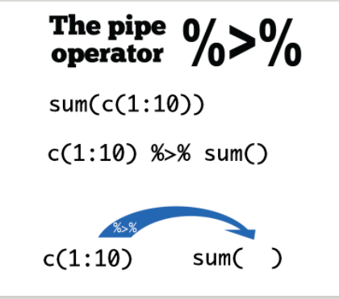
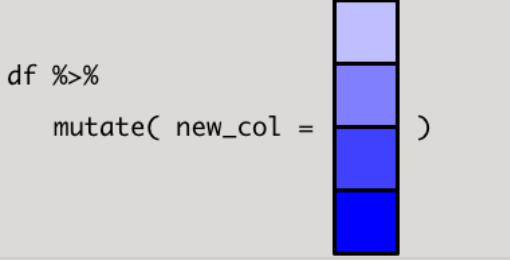
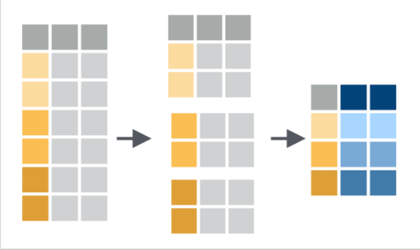
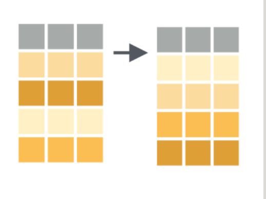

数据框的特性很丰富,在于:
 - 第一,它是列表的特殊形式,可以存储不同类型的数据
 - 它要求每个元素长度必须一致,因此长的像矩阵
 - 它的每个元素就是一个向量,而R语言有个优良特性,就是向量化操作,因此，使用函数非常方便

dplyr主要包含有

- mutate(),select(),rename(),filter()
- summarise(),group_by(),arrange()
- left_join(),right_join(),full_join()

## 新增一列mutate() 

## 管道 %>% 

Rstudio中的快捷键Ctrl + shift + M
代码可读性强
```r
sqrt(sum(abs(c(-10:10))))
#等价于
c(-10:10) %>% abs() %>% sum() %>% sqrt()

mutate(df, extra = reward)
df %>% mutate(extra = reward)
```
mutate本质还是介绍向量函数和向量化操作,只不过是换作在数据框中完成,这样更能形成"数据框进，数据框出"的思维


选取列select()
select 顾名思义选择,就是选择数据框的某一列,或者某几列。
选取后依然是数据框,数据框进数据框出是dplyr函数的第二个特点

如果不想要某列,可以在变量前面加 - 或者 !,两者的结果都是一样的

也可以通过位置索引进行选取,比如选取头三列

如果要选取数据框的列很多,我们也可以先观察列名的特征,用特定的函数进行选取,比如取以"s"开头的列

修改列名rename()
用rename()修改列的名字,具体方法是rename(.data,new_name = old_name),
和mutate()一样,等号左边是新的变量名,右边是已经存在的变量名(这是dplr函数的第三个特征)
筛选filter()
前面select()是列方向选择,而用filter()函数,我们可以对数据框行方向筛选,选出符合特定条件的某些行
这里的filter()函数不是字面上"过滤掉的意思",而是保留符合条件的行 
逻辑算符:& |  x %in% y 或用函数
`df %>% filter(score %in% c(70,90))`

summarise()函数非常强大,主要用于统计汇总,往往与其他函数配合使用

分组统计group_by()
实际中 summarise()函数往往配合group――by一起使用,即，先分组再统计.

我们箱统计每个学生的平均成绩,先按name分组再求平均,标准差

```r
df %>%
    group_by(name) %>%
    summarise(
        mean_score = mean(total),
        sd_score = sd(total)
    )
```
# 排序就是按照某个变量排序

 默认情况是从小到大,如果从高到低排序，一是:在用于排序的变量前面加 - 号 二是使用desc()函数

左联结 left_join() 右联结 right_join() 满联结 full_join() 内联结 inner_join() 


### 筛选联结
semi_join(x,y)，anti_join(x,y),函数不改变数据框x的变量的数量，主要影响的是x的观测,也就是说一些行,其功能类似filter()

dplyr:
 1.函数处理的是数据框,并且固定放置在第一个位置上(几乎所有dplyr的函数都是这样要求的)
 2. 数据框进数据框出
 3. 等号左边是新的变量名,右边是已经存在的变量名

