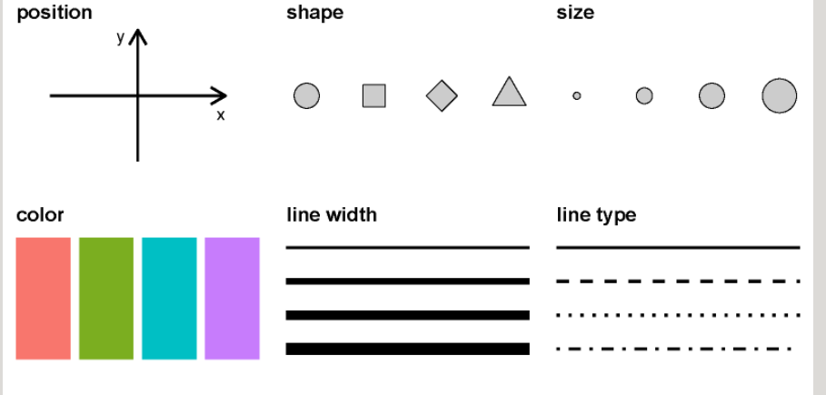
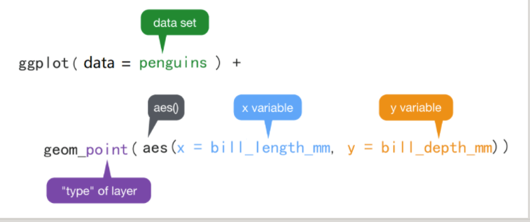
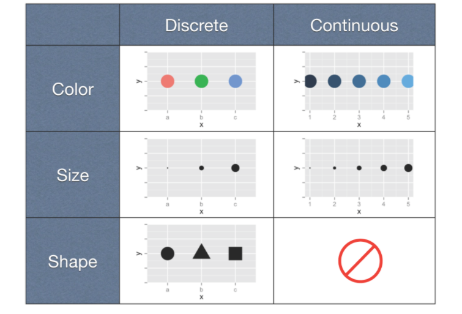
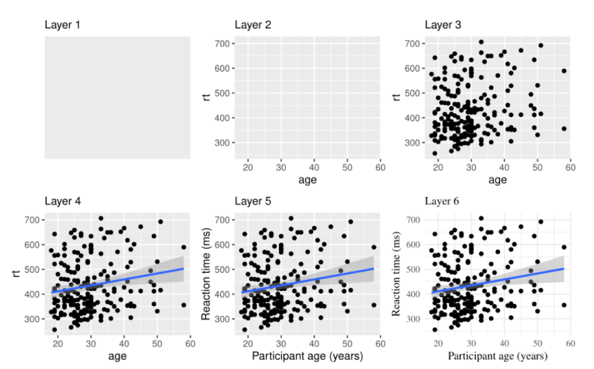
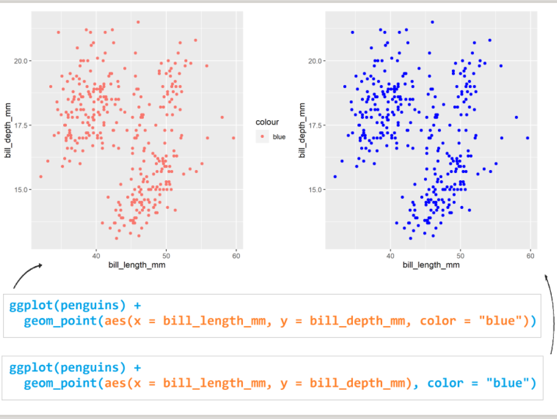

辛普森悖论（Simpsion's Paradox）。比如我们想研究下，学习时间和考试成绩的关联。结果发现两者呈负相关性，即补课时间越长，考试成绩反而越差（下图横坐标是学习时间，纵坐标是考试成绩），很明显这个结果有违生活常识

当我们把学生按照不同年级分成五组，再来观察学习时间和考试成绩之间的关联，发现相关性完全逆转了! 我们可以看到学习时间和考试成绩强烈正相关
### 什么是数据可视化

##### 14.2.1 图形属性(视觉元素)
图中画一个点,那么这个点就有(形状,大小,颜色,位置,透明度)等属性，这些属性就是图形属性(有时也称为图形元素或者视觉元素),常用图形属性:position,shape,size,color,line width,line type


ggplot2 有一套优雅的绘图语法,包名中"gg"是grammar of graphics的简称。Hadlay Wickham将这套可视化语法诠释为:
一张统计图形就是从数据到几何对象(geometric object)所包含的审美属性（aesthetic attribute,缩写aes）的一种映射。

ggplot()函数包括9个部件:
- 数据(data)(数据框)
- 映射(mapping)
- 几何形状(geom)
- 统计变换(stats)
- 标度(scale)
- 坐标系(coord)
- 分面(facet)
- 主题(theme)
- 存储和输出(output)
前三个是必须的。语法模板
```r
ggplot(data = <DATA>) +
<GEOM _FUNCTION>(mapping =aes(<MAPPINGS>))
```
图形中还可能包含数据的统计变换(statistical transformation,缩写stats),最后绘制在某个特定的坐标系(coordinate system,缩写coord)中,而分面(facet)则用来生成数据不同子集的图形

janitor::clean_names()
清理脏数据:
- 可怕的列名
- 包含Excel格式单不包含数据的行和列
- 日期存储为数字
- 值在认证列上分布不一致

- ggplot()初始化绘图,相当于打开了一张纸,准备画画. 
- ggplot(data = penguins)表示使用penguins这个数据集来花图。
- + 表示添加图层
- geom_point()表示绘散点图
- aes()表示数值和视觉属性之间的映射(mapping=aes())
- aes()除了位置上映射,还可以实现色彩,形状或透明度等视觉属性的映射。

ggplot()内部的颜色默认设置


几何形状
geom_point() 可以画散点图,也可以使用geom_smooth()绘制平滑曲线

## 图层从全局声明中继承
global & local
映射关系aes(x = bill_length_mm, y = bill_depth_mm) 写在ggplot()里, 为全局声明。那么，当geom_point()画图时，发现缺少图形所需要的映射关系（点的位置、点的大小、点的颜色等等），就会从ggplot()全局变量中继承映射关系。

如果映射关系aes(x = bill_length_mm, y = bill_depth_mm) 写在几何形状geom_point()里, 那么此处的映射关系就为局部声明, 那么geom_point()绘图时，发现所需要的映射关系已经存在，就不会继承全局变量的映射关系。

#图层之间没有继承关系

保存图片
可以使用ggsave()函数,将图片保存为所需要的格式,如".pdf",".png"等,还可以指定图片的高度和宽度,默认是units是英寸,也可以是"cm",or "mm"



问题:in aes()  or out of  aes()

与映射位置有关!

The aesthetic values in aes() are data which is properly fit to a scale, hence it must be interpreted with a guide/legend. Aesthetic values outside aes() are direct settings which by-pass the scaling mechanism hence no need for a guide/legend.