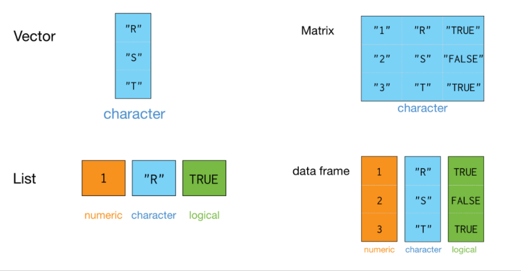
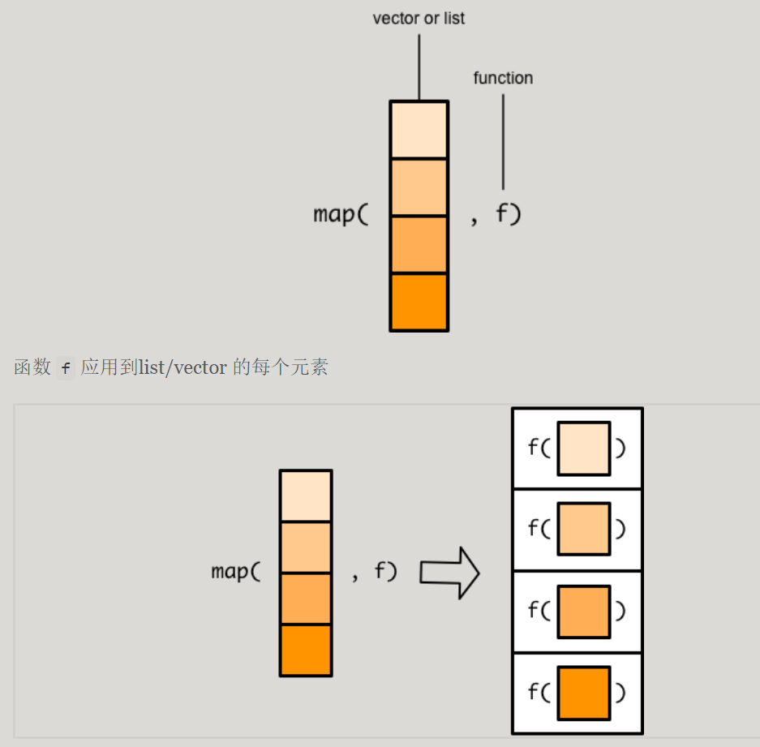
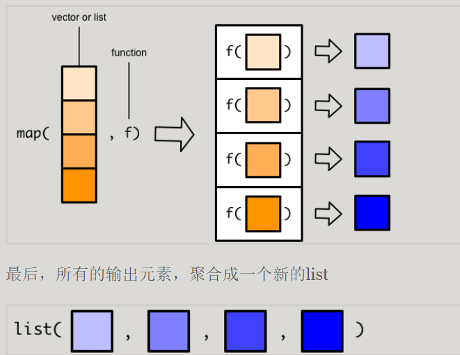
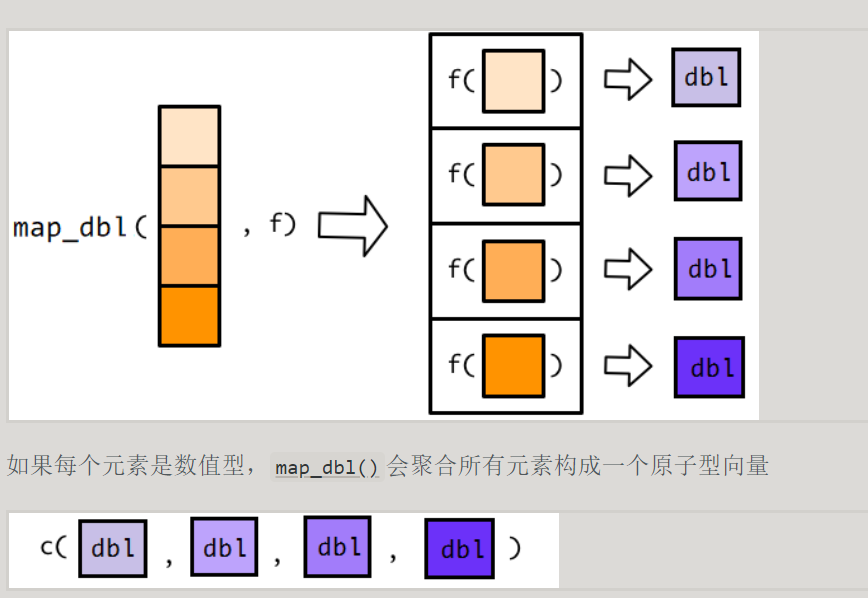
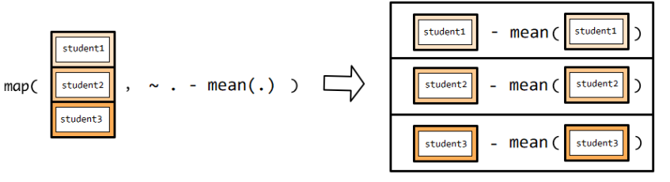
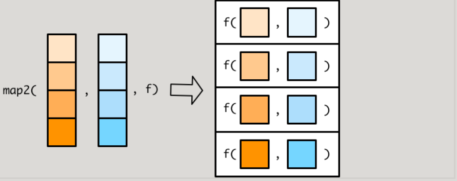
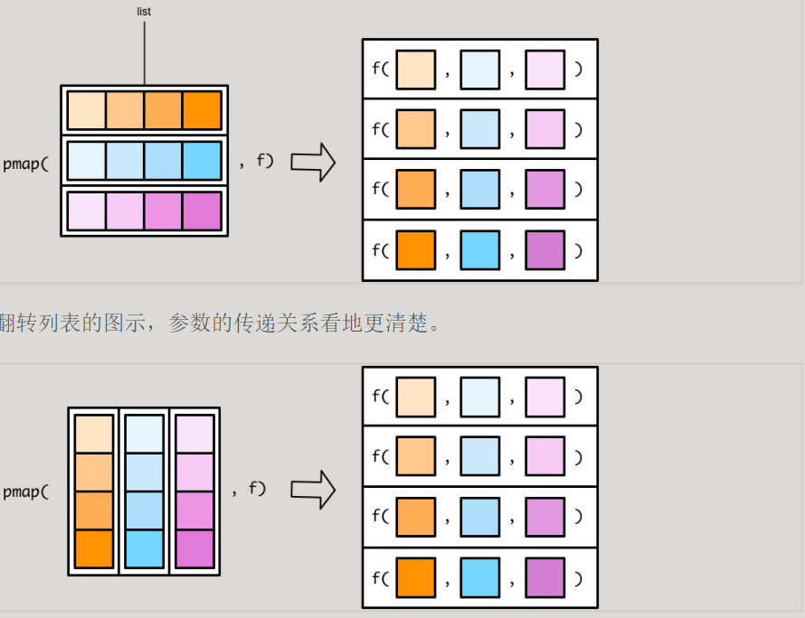
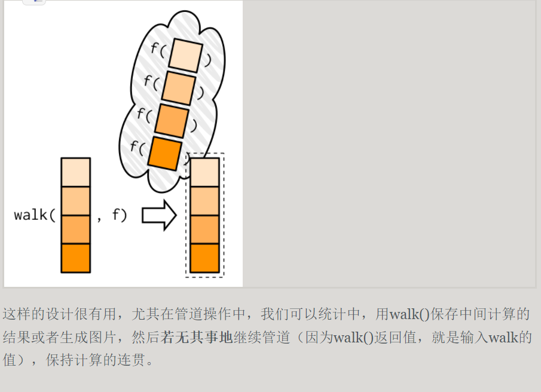

R 通常的数据结构是向量,矩阵，列表和数据框,如下图:

向量是R中最基础的一种数据结构,有种说法是"一切都是向量",R中的矩阵,数组甚至是列表都可以看成是某种意义上的向量.因此,使用向量化操作可以大大提高代码的运行效率.
---------------------------------------------
用在向量的函数用在list上,往往是行不通的
```r
v <- c(-2, -1, 0, 1, 2)
v
abs(v)

lst <- list(-2, -1, 0, 1, 2)
abs(lst)
```

```r
exams <- list(
  student1 = round(runif(10, 50, 100)),
  student2 = round(runif(10, 50, 100)),
  student3 = round(runif(10, 50, 100)),
  student4 = round(runif(10, 50, 100)),
  student5 = round(runif(10, 50, 100))
)
exams

mean(exams)
# NA
```

```r
# 笨办法
list(
  student1 = mean(exams$student1),
  student2 = mean(exams$student2),
  student3 = mean(exams$student3),
  student4 = mean(exams$student4),
  student5 = mean(exams$student5)
)

# 改进
map(exams,mean) # exams %>% map(mean)
```
map()函数的第一个参数是list或者vector（数据框是列表的一种特殊形式，因此数据框也是可以的）,第二个参数是函数


于是输入的list/vector中的每个元素,都对应一个输出



返回数值向量



#####我们也可以根据需要,让map返回我们需要的数据格式,purrr也提供了方便的函数,具体如下
function|returns results as
--------|----------------
map()|list
map_chr()|character vector
map_dbl()| double vector(numeric)
map_lgl()| logical vector
map_df() | data frame
####额外参数
#####将每位同学的成绩排序，默认的是升序
```r
map(exams, sort)
#map很人性化，可以让函数的参数直接跟随在函数名之和
map(exams, sort, decreasing = TRUE)
```
当然，也可以添加更多的参数，map()会自动的传递给函数。


###### 匿名函数
```r
my_fun <- function(x){
  x - mean(x)
}

exams %>% map_df(my_fun)
```
我们也可以不用命名函数，而使用匿名函数。匿名函数顾名思义，就是没有名字的函数。
```r
exams %>% 
  map(function(x) x - mean(x))
```

还可以更加偷懒，用~代替function()，但代价是参数必须是规定的写法，比如.x
```r
exams %>% map(~ .x - mean(.x))

```
###### 有时候，程序员觉得x还是有点多余，于是更够懒一点，只用 .， 也是可以的
~告诉map()后面跟随的是一个匿名函数,.对应函数的参数,可以认为是一个占位符,等待传送带的student1,student2到student5依次传递到函数机器

```r
exams %>% map(~ . - mean(.))

exams %>% 
    map_int(~ length(.[. > 80]))
```

##### 有三种方法将函数传递给map()

- 直接传递
`map(.x,mean,na.rm = TRUE)`
- 匿名函数
```r
map(.x,
    function(.x){
        mean(.x,na.rm = TRUE)
    }
)
```
- 使用 ~
```r
function(.x){
    .x *2
}
# Equivalent
~ .x * 2
```r
map(.x,
~mean(.x, na.rm = TRUE)
)
```

#函数式编程2
事实上,purrr()家族还有其他map()函数,可以在多个向量中迭代。也就说,同时接受多个向量的元素,并行计算。
比如,map()函数可以处理两个向量,而pmap()函数可以处理更多向量。
<font color =cyan >map2()</font>
map2()函数和map()函数类似,不同在于map()接受两个的向量,这两个向量必须是等长的

在map()函数使用匿名函数,代表输入向量的每个元素。在map2()函数,.不够用,所有需要要.x代表第一个向量的元素,.y代表第二个向量的元素

```r
 x <- c(1, 2, 3)
 y <- c(10, 20, 30)

 map2(x,y, ~.x + .y)
 
 ```

<font color =cyan >pmap()</font>
没有map3()或者map4()函数，只有 pmap() 函数可用(p 的意思是 parallel)

pmap()函数稍微有点不一样的地方:
- map()和map()函数,指定传递给函数f的向量,向量各自放在各自的位置上
- pmap()需要将传递给函数的向量名,先装入一个list()中,再传递给函数f


<font color =cyan >用在tibble</font>
tibble本质上就是list,这种结构就是pmap()所需要的,因此，直接应用函数即可。

```r
tibble(
    a = c(50, 60, 70),
    b = c(10, 90, 40),
    c = c(1, 105, 200)
) %>%
pmap_dbl(min)
```

<font color =cyan >匿名函数</font>
pmap()可以接受多个向量，因此在pmap()种使用匿名函数，就需要一种新的方法来标识每个向量。

由于向量是多个，因此不再用.x， .y，而是用..1, ..2, ..3 分别代表第一个向量、第二个向量和第三个向量。
```r
pmap(
  list(1:5, 5:1, 2), ~ ..1 + ..2 - ..3
  )
```

walk()函数与map()系列函数类似，但应用场景不同，map()在于执行函数操作，而walk() 保存记录数据（比如print(),write.csv(), ggsave()），常用于保存数据和生成图片。比如我们用map()生成系列图片，

map()函数是一定要返回列表的，但walk()看上去函数没有返回值，实际上它返回的就是它的输入，只是用户不可见而已。

