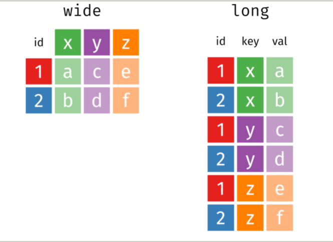
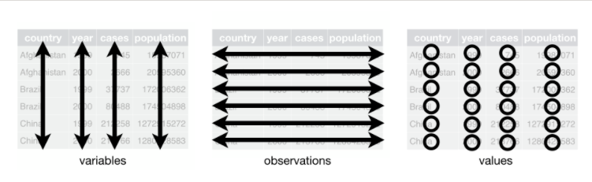

gather()/pivot_longer宽表格变成长表格
spread()/pivot_wider长表格变成宽表格

pivot_longer()函数有三个主要的参数:
- 参数cols,表示哪些列需要转换
- 参数names_to, 表示cols选取的这些列的名字,构成新的一列,这里需要取一个名字
- 参数values_to,表示cols选取的这些列的值,构成新的一列,这里也需要取一个名字

knitr::kable() 制成markdown的表

tidy data原则:
Hadley Wickamt提出了数据科学tidy原则,tidy思想体现在:
- 一切都是数据框,任何数据都可以规整
- 数据框的一列代表一个变量,数据框的一行代表一次观察
- 函数处理数据时,数据框进数据框出
根据Hadley Wickman的思想,这里的宽表格不是tidy的,只有长表格才是tidy的