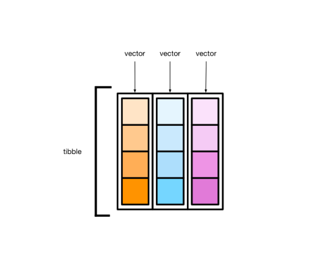
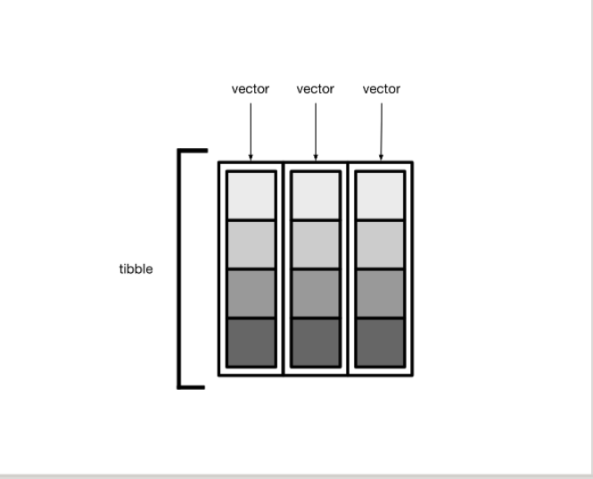
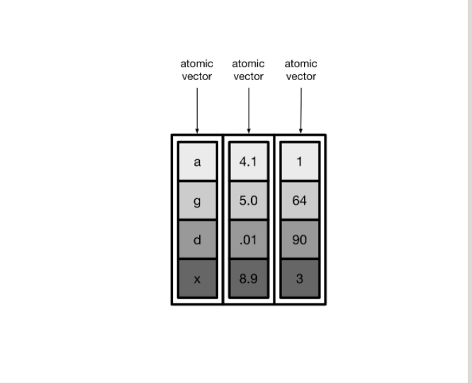
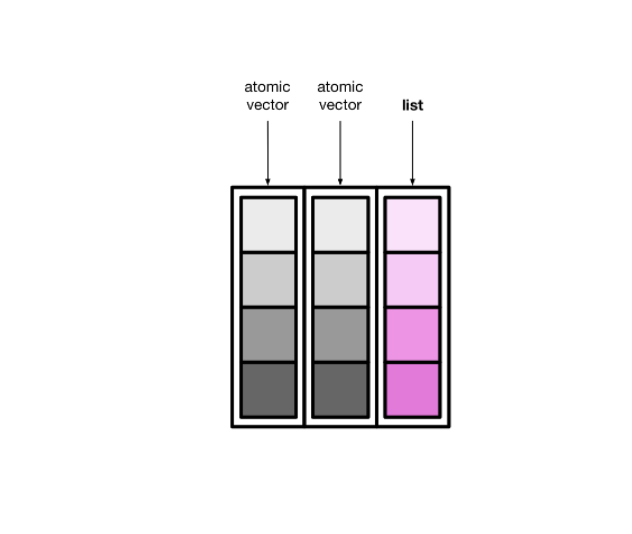
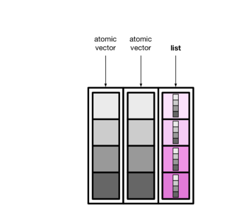
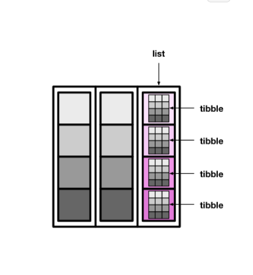

tidyverse家族:
功能 | 宏包
----|-----
有颜值担当 | ggplot2
数据处理王者|dplyr
数据转换专家|tidyr
数据载入利器|readr
循环加速器|purrr
强化数据框|tibble
字符串处理|stringr
因子处理|forcats
 
- tibble是用来替换data.frame类型的扩展的数据框
- tibble更早的检查数据，方便写出更干净、更多富有表现力的代码
tibble对data.frame做了重新的设定:
- tibble,不关心输入类型,可存储任意类型,包括list类型
- tibble, 没有行名设置,row.names
- tibble, 会自动添加列名
- tibble,支持任意列名
- tibble,类型只能回收长度为1的输入
- 会懒加载参数,并按顺序运行
- 是tbl_df类型

<font color=cyan>在R 4.0 后，data.frame() 不会将字符串型变量自动转换成因子型</font>

tibble另一个优势：tibble输出时，会显示多一行，用来指定每一列的类型。
tibble用缩写定义了7种类型:
类型|含义
----|----
int |代表integer
dbl | 代表double
chr | 代表character向量或字符串
dttm| 代表日期+时间(date+time)
fctr| 代表因子类型factor
lgl | 代表逻辑判断TRUE或者FALSE
date| 代表日期dates

### tibble数据操作
创建tibble
tibble()创建一个tibble类型的data.frame:
`tibble(a = 1:5, b = letters[1:5])`

转换成tibble类型意思就是说，刚开始不是tibble, 现在转换成tibble
- data.frame 转换成tibble
- vector转换成tibble
- list转换成tibble
- matrix转换成tibble


data.frame是支持行名的，但tibble不支持行名，这也是两者不同的地方

### 修复列名
.name_repair = "check_unique"检查列名唯一性,但不做修复(默认)
.name_repair = "minimal",不检查也不修复,维持现状
.name_repair = "unique" 修复列名,使得列名唯一且不为空
.name_repair = "universal"修复列名,使得列名唯一且语法可读


#List-columns(列表列)
tibble本质上是向量构成的列表

大多数情况下,我们接触到的向量是原子型向量(atomic vectors),所谓原子型向量就是向量元素为单个值,比如"a"或者 1

tibble还有可以允许某一列为列表(list)，那么列表构成的列，称之为列表列（list columns）

<font color = cyan>列表列</font>非常灵活,因为列元素可以是原子型向量,列表，矩阵或者小的tibble


# nested tibble
tibble的列表列装载数据的能力很强大，也很灵活。下面，我们将介绍如何创建和操控有列表列的tibble。 
 ## creating
 这里有一个tibble,我们有三种方法可以创建列表列

 - nest()
 - summarize() and list()
 - mutate() and map()
- 
  <font color = cyan>tidyr::nest()</font>

  使用tidyr::nest()函数，创建有列表列的tibble。
  

 <font color = cyan>tidyr::summarise()</font>

  group_by() 和 summarize()组合可以将向量分组后分别压缩成单个值，事实上，summarize()还可以创建列表列。
  
  data就是构建的列表列，它的每个元素都是一个向量，对应一个species。这种方法和nest()方法很相似，不同在于，summarise() + list() 构建的列表列其元素是原子型向量，而nest()构建的是tibble.
  summarise() + list()的方法还可以在创建列表之前,对数据简单处理,比如排序
  `data = list(sort())`
  
 <font color = cyan>tidyr::mutate()</font>
第三种方法是用rowwise() + mutate(),比如下面为每个岛屿(island)创建一个与该岛企鹅<font color = cyan>数量等长的随机数向量</font>,简单点说,这个岛屿上企鹅有多少只,那么随机数的个数就有多少个。

Unnesting
用unnest()函数可以把<font color = cyan>列表列</font>转换成常规列的形式,比如上节中的tb
这里把想要打开的列data，作为参数提供给unnest(cols = )
```r
tb %>% 
  unnest(cols = data)
```
 
 <font color = cyan>Manipulating</font>
 操控列表是一件有趣的事情,我们常常会借助于行方向的操作(rowwise),比如找出每个岛屿企鹅的数量,我们需要对data列表列的元素依次迭代
 ```r
 tb %>% 
  rowwise() %>% 
  mutate(num_species = nrow(data))
```