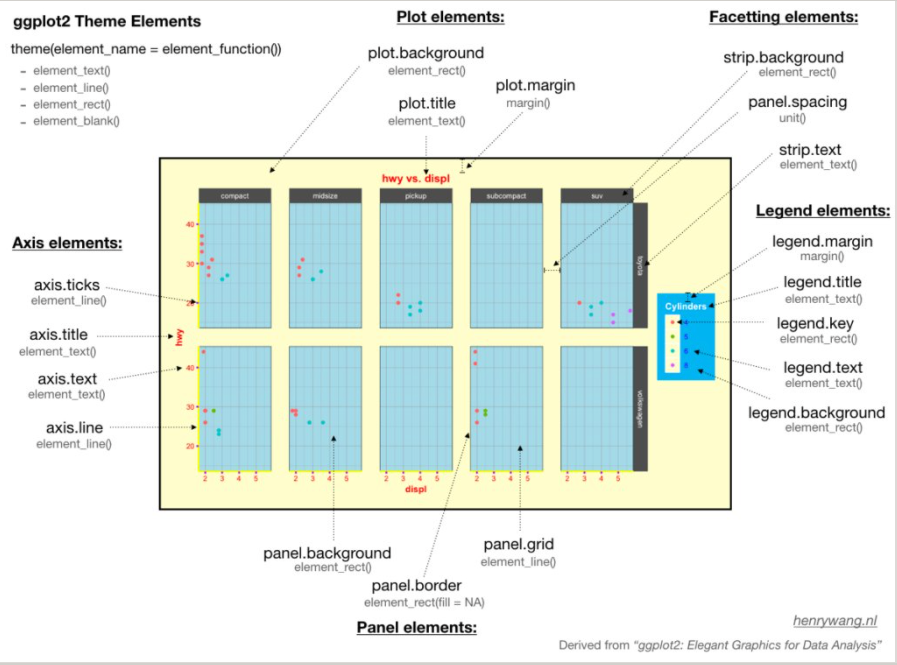

theme(element_name = element_function())

element_function()有四个元素函数

element_text():文本,一般用于控制标签和标题的字体风格
element_line():线条，一般用于控制线条或线段的颜色或线条类型
element_rect():矩形区域,一般用于控制背景矩形的颜色或者边界线条类型
element_rect():空白,就是不分配相应的绘图空间,即删去这个地方的绘图元素

每个元素函数有一些列控制外观的参数

 ## 图表整体元素

 |描述|主题元素|类型|
 |:-|:-|:-|
 |整个图形背景|plot.background|element_rect()|element_rect()|
 |图形标题|plot.title|element_text()|
 |图形边距|plot.margin|margin()|

 ## 坐标轴元素
 |描述|主题元素|类型|
 |:-|:-|:-|
 |坐标轴刻度|axis.ticks|element_line()|
 |坐标轴标题|axis.title|element_text()|
 |坐标轴标签|axis.text|element_text()|
 |直线和坐标轴|axis.line|element_line()|

## 面板元素

|描述	|主题元素|	类型|
|:-|:-|:-|
|面板背景|	panel.background|	element_rect()|
|面板网格线|	panel.grid|	element_line()|
面板边界|	panel.border|	element_rect()|

## 图例元素

|描述|	主题元素|	类型|
|:-|:-|:-|
|图例背景|	legend.background	|element_rect()|
|图例符号|	legend.key	|element_rect()|
|图例标签|	legend.text|	element_text()|
|图例标题|	legend.title	|element_text()|
|图例边距|	legend.margin|	margin|
|图例位置|	legend.postion|	“top”, “bottom”, “left”, “right”|
 
 ## 分面元素
 |描述	|主题元素	|类型|
 |:-|:-|:-|
|分面标签背景	|strip.background|	element_rect()|
|条状文本	|strip.text	|element_text()|
|分面间隔	|panel.spacing|	unit|

# ggthemes宏包也提供了很多优秀的主题风格

小结
