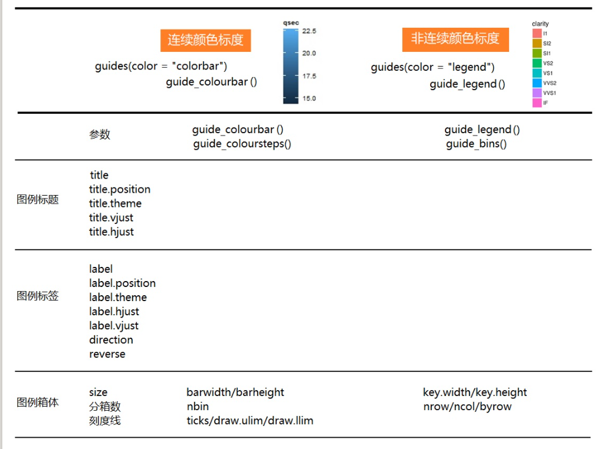
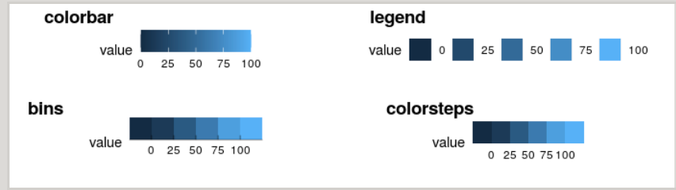

调整图例样式,使用guides()函数

- guide_colorbar()：continuous colors
- guide_legend()：discrete values
- guide_axis()：control axis text/spacing,add a secondary axis
- guide_bins()：creates "bins" of values in the legend
- guide_colorsteps()：make colorbar discrete

