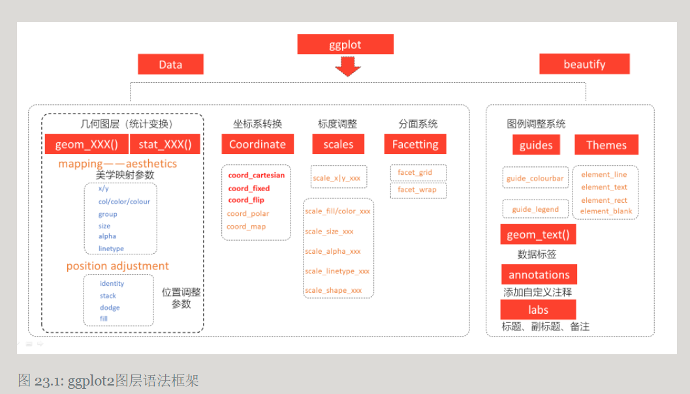
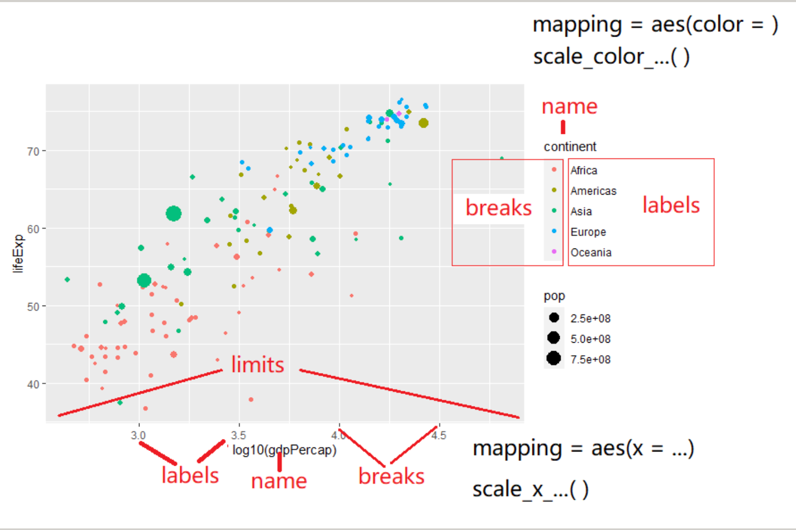

几何图层(统计变换)geom_XXX()(stat_XXX())
mapping--aesthetics 美学映射参数 x、y、col、color、group、size、alpha、linetype
position adjustment 位置调整参数
identity、stack、dodge、fill

坐标系变换: coord_cartesian、coord_fixed、coord_flip、coord_polar、coord_map
标度调整：scale_x |y_xxx、scale_fill/color_xxx、scale_size_xxx、scale_alpha_xxx、scale_linetype_xxx、scale_shape_xxx
分面系统：facet_grid、facet_wrap

图例调整系统：
guides、themes
guides_colourbar、guide_legend
element_line、element_text、element_rect、element_blank
数据标签：geom_text()
添加自定义注释：annotations()
标题、副标题、备注：labs()

ggplot2中,映射是数据转化到图形属性,这里的图形属性是指视觉可以感知的东西,比如大小,形状,颜色和位置等.我们今天讨论的标度(scale)是控制着数据到图形属性映射的函数,每一种标度都是从数据空间的某个区域(标度的定义域)到图形属性空间的某个区域(标度的值域)的一个函数.

标度是用于调整数据映射的图形属性。


坐标轴和图例是同样的东西


丰富的标度体系:
坐标轴标度：
连续型：scale_x_conintuous()、scale_x_log10()、scale_x_reverse()
离散型：scale_x_discrete()

颜色标度：
连续型：scale_color_continous()、scale_color_gradient()
离散型：scale_color_discrete()、scale_color_brewer()、scale_color_hue()、scale_color_grey()
自定义：scale_color_manual()
同一型：scale_color_identity()
填充标度:scale_fill_continous()、scale_fill_discrete()、scale_fill_manual()、scale_fill_identity()

每个标度函数内部都有丰富的参数系统
```r
scale_colour_manual(
  palette = function(), 
  limits = NULL,
  name = waiver(),
  labels = waiver(),
  breaks = waiver(),
  minor_breaks = waiver(),
  values = waiver(),
  ...
)
```
参数name,坐标和图例的名字,如果不想要图例的名字,就可以name = NULL
参数limits, 坐标或图例的范围区间。连续性c(n,m),离散型c("a","b","c")
参数breaks,控制显示在坐标轴或者图例上的值(元素)
参数labels，坐标和图例的间隔标签.

用标度还是主题?
这里有个原则: 主题风格不会增加标签，也不会改变变量的范围,主题只会改变字体、大小，颜色等。