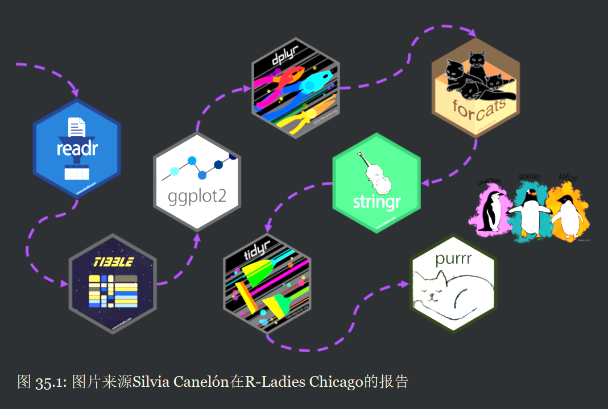

***readr宏包:***

读入数据是第一步,我们可以用readr导入数据
- 逗号(,)分割的文件read_csv()
- 制表符(tab)分割的文件read_tsv()
- 任意的分隔符read_delim()
- 固定宽度的文件 read_fwf()
- 空格分割的文件 read_table()
- 网页log文件 read_log()
  
**tibble宏包：**

tibble是升级版的dataframe

#### tibble
- 列出变量的类型(这个很不错)
- 只列出10行
- 只列出有限列数(与屏幕相适应的)
- 高亮 NA

**ggplot2宏包**

**dplyr宏包**
- 创建新变量 mutate()
- 分组统计 summarize() + group_by()
- 筛选 filter()
- 重命名变量 rename()
- 排序 arrange()

**forcats宏包**
forcats宏包主要用于分类变量和因子变量,对于数值型变量，可以通过factor()函数将它转换成因子型变量

**stringr**
- 匹配
- 字符串子集
- 字符串长度
- 字符串分割
- 字符串合并

**tidyr宏包**

**purrr宏包**
purr宏包提供了map()等一系列函数，取代for和while循环方式,实现高效迭代，保持语法一致，同时增强了代码的可读性。