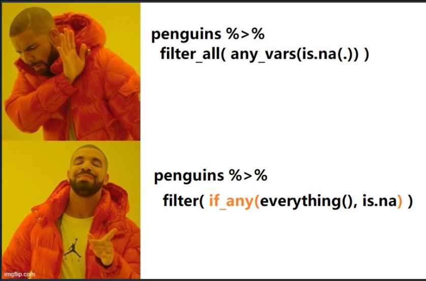

**dplyr 1.0版本增加了across()函数，这个函数集中体现了dplyr宏包的强大和简约，今天我用企鹅数据，来领略它的美。**

`across(.cols = , .fns = , .names = )`

第一个参数.cols = ，选取我们要需要的若干列，选取多列的语法与select()的语法一致，选择方法非常丰富和人性化

基本语法:
- :，变量在位置上是连续的，可以使用类似 1:3 或者species:island
- !，变量名前加!，意思是求这个变量的补集，等价于去掉这个变量，比如- !species
- & 与 |，两组变量集的交集和并集，比如 is.numeric & !year, 就是选取数值类型变量，但不包括year; 再比如 is.numeric | is.factor就是选取数值型变量和因子型变量
- c()，选取变量的组合，比如c(a, b, x)

通过人性化的语句
- everything(): 选取所有的变量
- last_col(): 选取最后一列，也就说倒数第一列，也可以last_col(offset = 1L) 就是倒数第二列

通过变量名的特征
- starts_with(): 指定一组变量名的前缀，也就把选取具有这一前缀的变量，starts_with("bill_")
- ends_with(): 指定一组变量名的后缀，也就选取具有这一后缀的变量，ends_with("_mm")
- contains(): 指定变量名含有特定的字符串，也就是选取含有指定字符串的变量，ends_with("length")
- matches(): 同上，字符串可以是正则表达式

通过字符串向量
- all_of(): 选取字符串向量对应的变量名，比如all_of(c("species", "sex", "year"))，当然前提是，数据框中要有这些变量，否则会报错。
- any_of(): 同all_of()，只不过数据框中没有字符串向量对应的变量，也不会报错，比如数据框中没有people这一列，代码any_of(c("species", "sex", "year", "people"))也正常运行，挺人性化的

通过函数:
- 常见的有数据类型函数 where(is.numeric), where(is.factor), where(is.character), where(is.date)

第二个参数.fns =，我们要执行的函数（或者多个函数），函数的语法有三种形式可选：

- A function, e.g. mean.
- A purrr-style lambda, e.g. ~ mean(.x, na.rm = TRUE)
- A list of functions/lambdas, e.g. list(mean = mean, n_miss = ~ sum(is.na(.x))

第三个参数.names =, 如果.fns是单个函数就默认保留原来数据列的名称，即"{.col}" ；如果.fns是多个函数，就在数据列的列名后面跟上函数名，比如"{.col}_{.fn}"；当然，我们也可以简单调整列名和函数之间的顺序或者增加一个标识的字符串，比如弄成"{.fn}_{.col}"，"{.col}_{.fn}_aa"

across()函数与summarise()和mutate()函数配合起来使用,非常方便，但与filter()函数不是很理想

从函数形式上看，if_any 对应着 across的地位，

# 纠缠不清的迭代
- rowwise() 一行一行的处理
- across() 一列一列的处理
- rowwise() + across() 这种组合，双重迭代，(一行一行 + 一列一列)就变成了一个一个的处理
- across() + purrr::map_dbl()这种组合分两种情形：
-purrr::map_dbl() 作为across( .fns = ) 中的函数，即across(.cols = , .fns = map_dbl() )。across()一列一列的迭代，每一列又传入purrr::map_dbl()再次迭代，因此这里是双重迭代
- across()作为purrr::map_df(.x = )的数据，即purrr::map_df(.x = across(), .f = )。因为在mutate()中across()返回数据框，因此可以把across()整体视为数据框，然后这个数据框传入purrr::map_df(.x = )进行迭代，因此这种情形可以认为只有purrr::map_*()一次迭代。