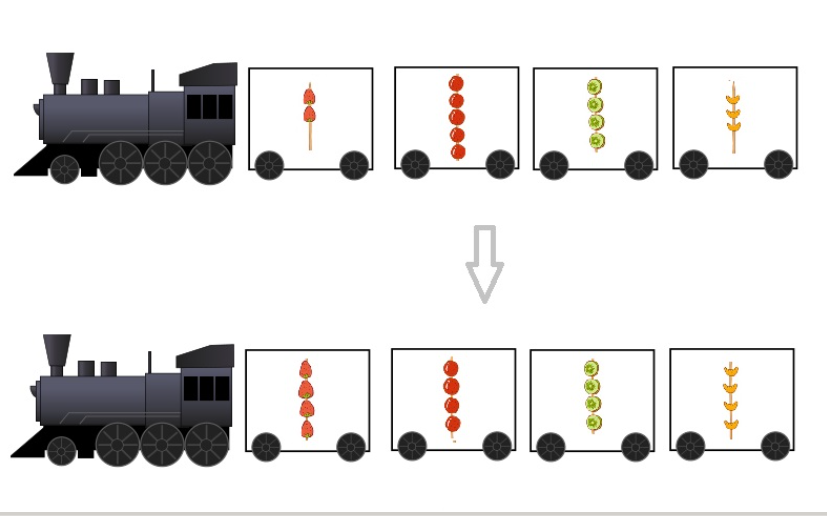

```r
m <-matrix(
    c(2,4,3,1,5,7),
    nrow =2,
    ncol =3
)
m
```
```r
matrix(
  c(2, 4, 3, 1, 5, 7),
  nrow = 2, 
  ncol = 3,
  byrow = TRUE
)
```
矩阵的属性:
```r
# 类型
class(m)
#长度
length(m)
#维度
dim(m)
```
```r
列表
list1 <-list(
    a = c(5,10),
    b = c("I","love","R","languge","!"),
    c =c(TRUE,TRUE,FALSE,TRUE)

)
list1
```

列表可以想象成一个小火车,如果每节车厢装的都是向量而且等长,那么这种特殊形式的列表就变成了数据框(data frame)

```r
df <- data.frame(
    name = c("Alice","Bob","Carl","Dave"),
    age  = c(23,34,23,25),
    marriage = c(TRUE,FALSE,TRUE,FALSE),
    color  = c("red","blue","orange","purple")
)
df
```
数据框的属性
class(of)
nrow(df)
ncol(df)