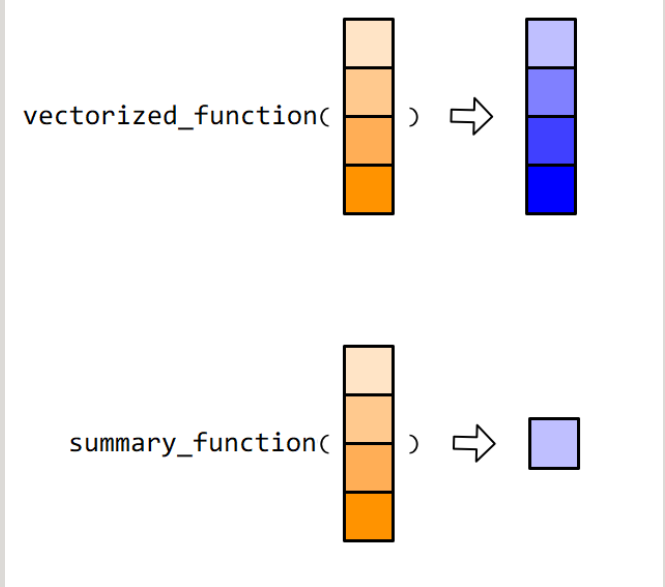

给出向量的分位数:
`quantile(x)`

判断是否为数值型/字符串型
```r
is.numeric(x)
is.character(x)
```
转化成字符串型
```r
as.character(x)
# 转化成数值型
as.numeric(x)
```
判断向量元素是否大于5
```r
x <- c(2, 7, 8, 9, 3)
x > 5
ifelse(x > 5,"big","small")

向量的函数:
用在向量上的函数,可以分为向量化函数(vectorized function)和汇总类函数(summary function)


