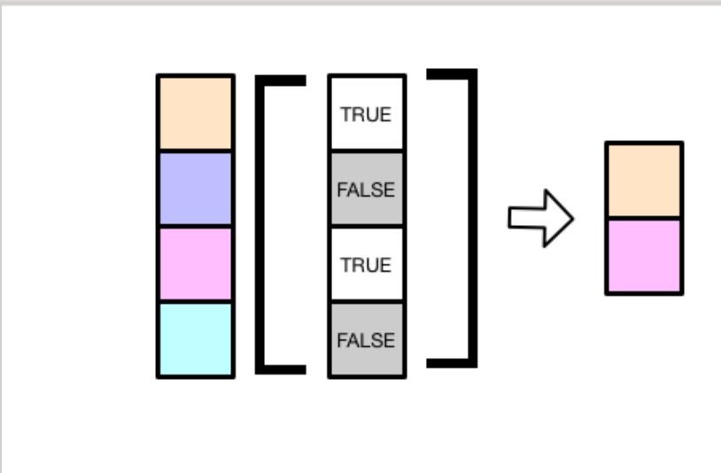

打个比方:对象就是我们在计算机里新建了存储空间,好比一个盒子,我们可以往盒子里面装东西(赋值),可以查看里面的内容或者对里面的内容做计算(函数),也可以从盒子里取出部分东西(子集选取)
子集选取，就是从盒子里取东西出来
```r
x <- c(1.1,2.2,3.3,4.4,5.5)
# 正整数:指定向量元素中的位置
x[1]
x[c(1,3)]
x[c(3,1)]
#负整数:删除指定位置的元素
x[-2]
x[c(-3,-4)]
#逻辑向量:将TRUE对应位置的元素提取出来
x[c(TRUE,FALSE,TRUE,FALSE,TRUE)]


列表:
```r
l <- list(
    "one" = c("a","b","c"),
    "two" = c(1:5)
    "three" = c(TRUE,FALSE)
)
1
# 位置索引:
l[1]
# 也可以使用元素名
l["one"]
#如果想提取列表某个元素的值,需要使用[[
l[[1]]
l[["one"]]
# 等价于l$one
```
数据框:具有list和matrix的双重属性
- 当选取数据框的某几列的时候,可以和list一样,指定元素位置索引,比如df[1:2]选取前两列
- 也可以像矩阵一样,按照行和列的标识选取,比如df[1:3,]选取前三行的所有列
```r
df<- data.frame(
    x = 1:4
    y = 4:1
    z =c("a","b","c","d")
) 
df
# like  a list
df[1:2]
df[c("x","z")]
df[["x"]]
df$x

#like a matrix 
df[, c("x","z")]
df[1:3, ]
df[, "x"]

```
增强型数据框
tibble是增强型的data.frame,选取tibble的行或者列,即使遇到单行,或者单列的时候,数据也不会降维,总是返回tibble,即仍然是数据框的形式
```r
tb <- tibble::tibble(
    x =1:4,
    y =4:1,
    z =c("a","b","c","d")
)
tb
tb["x"]
tb[,"x"]
```
R语言双冒号作用:
 回答1:要使用某个包里的函数,通常做法是先加载(library)包,在调用函数而package name::functionname的用法,一是可以在需要用某个函数时临时直接加载包,不用事先library.另一点更重要的是尽可能减少library带来的附带作用,这一点在开发R包时影响较大.

回答2:当多个包下有同一个名字函数时,可以用::指定包